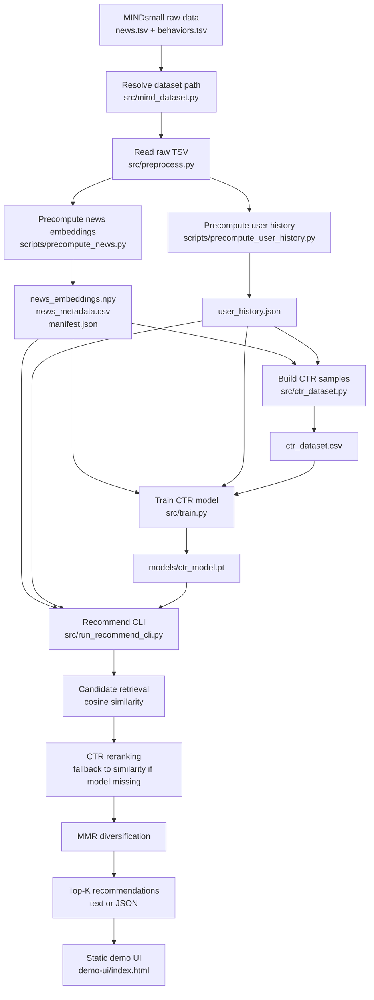

# Pipeline: News Article Recommendation System

## 1. Muc tieu pipeline

Pipeline cua project dung MINDsmall dataset de tao he thong goi y bai bao theo huong offline/CLI. Luong chinh gom: doc du lieu MINDsmall, tao embedding cho bai bao, tao lich su doc cua user, tao du lieu CTR, train mo hinh CTR reranker, sau do sinh danh sach goi y bang CLI hoac hien thi bang static demo UI.

Project hien khong con dung Streamlit. Demo UI trong `demo-ui/` chi dung de trinh bay output JSON da duoc tao boi CLI.

## 2. So do tong quan



## 3. Cau truc du lieu dau vao

Project tim MINDsmall train data theo cac layout pho bien sau:

```text
data/MINDsmall/MINDsmall_train/news.tsv
data/MINDsmall/MINDsmall_train/behaviors.tsv

data/MINDsmall_train/news.tsv
data/MINDsmall_train/behaviors.tsv

data/MINDsmall/train/news.tsv
data/MINDsmall/train/behaviors.tsv
```

Neu dataset nam o noi khac, truyen duong dan bang `--mind-dir`:

```powershell
python scripts/precompute_news.py --mind-dir "F:\path\to\MINDsmall"
python scripts/precompute_user_history.py --mind-dir "F:\path\to\MINDsmall"
```

## 4. Pipeline build artifact

### Buoc 1: Resolve dataset

File chinh: `src/mind_dataset.py`

Nhiem vu:

- Tim folder chua `news.tsv` va `behaviors.tsv`.
- Ho tro ca folder chua truc tiep file TSV va folder cha co `MINDsmall_train`.
- Bao loi ro rang neu thieu dataset.

Output logic:

```text
MindDatasetPaths(
  root=<folder train>,
  news_path=<folder train>/news.tsv,
  behaviors_path=<folder train>/behaviors.tsv
)
```

### Buoc 2: Doc raw data

File chinh: `src/preprocess.py`

`load_news(news_path)` doc `news.tsv` va tao them cot `text`:

```text
text = title + ". " + abstract
```

`load_behaviors(behaviors_path)` doc `behaviors.tsv` voi cac cot:

```text
impression_id, user_id, time, history, impressions
```

### Buoc 3: Tao news embeddings

Lenh:

```powershell
python scripts/precompute_news.py
```

File chinh:

- `scripts/precompute_news.py`
- `src/preprocess.py`
- `src/config.py`

Luong xu ly:

1. Load `news.tsv`.
2. Ghep `title` va `abstract` thanh text.
3. Encode text bang SentenceTransformer, mac dinh `sentence-transformers/all-MiniLM-L6-v2`.
4. L2 normalize embedding.
5. Ghi embedding, metadata va manifest.

Output:

```text
data/precompute/news_embeddings.npy
data/precompute/news_metadata.csv
data/precompute/manifest.json
```

### Buoc 4: Tao user history

Lenh:

```powershell
python scripts/precompute_user_history.py
```

File chinh:

- `scripts/precompute_user_history.py`
- `src/preprocess.py`

Luong xu ly:

1. Load `behaviors.tsv`.
2. Doc cot `history`.
3. Gom cac news da doc theo tung `user_id`.
4. Ghi ra JSON de tranh phu thuoc pickle.

Output:

```text
data/precompute/user_history.json
```

### Buoc 5: Tao CTR dataset

Lenh:

```powershell
python scripts/build_ctr_dataset.py
```

File chinh:

- `scripts/build_ctr_dataset.py`
- `src/ctr_dataset.py`

Luong xu ly:

1. Load `behaviors.tsv`.
2. Voi moi impression:
   - item co label `-1` duoc xem la positive click.
   - item co label `-0` duoc xem la negative sample.
3. Voi moi positive, sample toi da `neg_ratio` negative.
4. Chi giu news id co ton tai trong `news_metadata.csv`.

Output:

```text
data/precompute/ctr_dataset.csv
```

### Buoc 6: Train CTR model

Lenh:

```powershell
python -m src.train
```

Mac dinh lenh tren train tren toan bo `data/precompute/ctr_dataset.csv`.

Lenh smoke test nhanh tren CPU:

```powershell
python -m src.train --max-rows 5000 --epochs 1 --batch-size 512
```

Lenh train CPU nhanh hon cho 150k rows:

```powershell
python -m src.train --max-rows 150000 --epochs 3 --batch-size 2048 --torch-threads 4
```

File chinh:

- `src/train.py`
- `src/dl_model.py`
- `src/user_profile.py`
- `src/embedding.py`

Luong xu ly:

1. Load `news_embeddings.npy` va `news_metadata.csv`.
2. Load `user_history.json`.
3. Load `ctr_dataset.csv`.
4. Voi moi sample `(user_id, news_id, label)`:
   - tao user vector bang trung binh embedding cac bai user da doc.
   - lay item vector tu embedding cua `news_id`.
   - neu user khong co history hop le, dung mean news embedding.
5. Mac dinh materialize user/item/label thanh tensor truoc khi train de giam Python overhead tren CPU.
6. Neu may it RAM, dung `--lazy-dataset` de quay lai dataset tinh theo sample va cache user vector theo `user_id`.
7. Train `CTR_MLP` voi input la noi vector user va vector item.
8. Danh gia validation AUC theo tung epoch.
9. Luu model state dict.

Output:

```text
models/ctr_model.pt
```

## 5. Pipeline inference/recommendation

Lenh dang text:

```powershell
python -m src.run_recommend_cli --user U8125 --topk 10
```

Lenh dang JSON de dua vao demo UI:

```powershell
python -m src.run_recommend_cli --user U8125 --topk 10 --json
```

File chinh:

- `src/run_recommend_cli.py`
- `src/recommender.py`
- `src/embedding.py`
- `src/user_profile.py`
- `src/candidate_generation.py`
- `src/ranking.py`
- `src/diversity.py`

Luong inference:

1. CLI nhan `--user`, `--topk`, `--candidate-k`.
2. `src/recommender.py` load tat ca artifact can thiet:
   - `news_embeddings.npy`
   - `news_metadata.csv`
   - `user_history.json`
3. Tao user vector:
   - user da co history: lay trung binh embedding cac bai da doc.
   - user cold-start hoac history rong: dung mean news embedding.
4. Candidate retrieval:
   - tinh cosine similarity giua user vector va toan bo news embeddings.
   - loai cac bai user da doc neu khong phai cold-start.
   - lay top `candidate-k`.
5. CTR reranking:
   - neu `models/ctr_model.pt` ton tai, dung `CTR_MLP` de score lai candidates.
   - neu model thieu hoac load loi, fallback sang similarity ranking.
6. MMR diversification:
   - chon final top-K bang MMR de can bang relevance va diversity.
7. CLI tra ket qua:
   - text thuong cho terminal.
   - JSON neu dung `--json`.

## 6. Artifact contract

| Artifact | Tao boi | Dung boi | Bat buoc |
|---|---|---|---|
| `data/precompute/news_embeddings.npy` | `scripts/precompute_news.py` | train, recommend | Co |
| `data/precompute/news_metadata.csv` | `scripts/precompute_news.py` | train, recommend | Co |
| `data/precompute/manifest.json` | `scripts/precompute_news.py` | audit/debug | Khong |
| `data/precompute/user_history.json` | `scripts/precompute_user_history.py` | train, recommend | Co |
| `data/precompute/ctr_dataset.csv` | `src.ctr_dataset.build_ctr_samples` | train | Co neu train CTR |
| `models/ctr_model.pt` | `python -m src.train` | CTR reranking | Khong, co fallback |

## 7. Thuat toan trong pipeline

### Content-based retrieval

Project dung embedding cua bai bao de tim bai tuong tu voi so thich cua user. User vector duoc tao bang trung binh embedding cac bai trong lich su doc.

### Cosine similarity candidate generation

`src/candidate_generation.py` tinh cosine similarity giua user vector va tung news embedding, sau do chon top candidates.

### CTR neural reranking

`src/dl_model.py` dinh nghia `CTR_MLP`. Model nhan:

```text
[user_embedding, item_embedding]
```

va du doan xac suat click. Day la reranker, khong phai retrieval layer dau tien.

### MMR diversification

`src/diversity.py` dung MMR de giam viec final top-K bi qua giong nhau. Score MMR can bang:

```text
lambda * relevance - (1 - lambda) * similarity_to_selected_items
```

## 8. Cold-start va fallback

### Cold-start user

Neu `user_id` khong ton tai trong `user_history.json` hoac khong co bai doc hop le, project dung mean news embedding lam user vector. Output CLI/JSON co field:

```text
cold_start: true
```

### Missing CTR model

Neu `models/ctr_model.pt` chua ton tai, he thong van recommend duoc bang cosine similarity. Output co:

```text
ranking_source: "similarity"
fallback_reason: "<ly do thieu model>"
```

Neu model ton tai va load duoc:

```text
ranking_source: "ctr"
```

## 9. Demo UI pipeline

Demo UI nam trong:

```text
demo-ui/index.html
demo-ui/styles.css
demo-ui/demo.js
```

Vai tro:

- Khong chay model.
- Khong goi backend.
- Khong thay the CLI.
- Chi nhan JSON output tu CLI hoac dung sample data de trinh bay UX/UI demo.

Luong demo:

1. Chay CLI voi `--json`.
2. Copy JSON output.
3. Mo `demo-ui/index.html`.
4. Paste JSON vao UI.
5. UI render cards, score, source ranking, cold-start status va pipeline explanation.

## 10. Lenh chay day du tu dau

```powershell
python -m venv .venv
.\.venv\Scripts\Activate.ps1
pip install -r requirements.txt

python scripts/precompute_news.py
python scripts/precompute_user_history.py

python scripts/build_ctr_dataset.py

python -m src.train --max-rows 5000 --epochs 1 --batch-size 512

python -m src.run_recommend_cli --user U8125 --topk 10
python -m src.run_recommend_cli --user U8125 --topk 10 --json
```

## 11. Diem can hoan thien tiep

1. Them `scripts/check_artifacts.py` de kiem tra nhanh artifact con thieu.
2. Luu `models/metrics.json` va `models/model_config.json` sau training.
3. Them evaluation script voi Recall@K, NDCG@K, MRR.
4. Toi uu candidate retrieval bang ANN neu corpus lon.
5. Them CI chay compile va unit tests.
